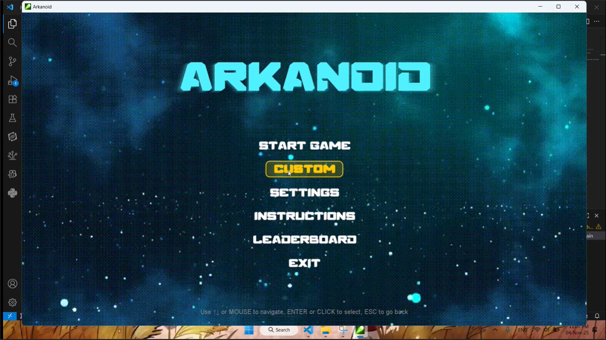
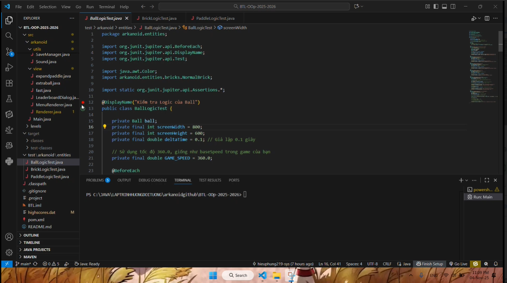

## UML Diagram
Dưới đây là sơ đồ UML đã được hoàn thiện cho hệ thống:

---

## Demo Tuần 6
Xem video demo tại đây:  
[Demo Tuần 6](https://github.com/user-attachments/assets/f2765ee5-be4d-4b31-8f06-79465985e0ae)

---

## Demo Tuần 7
 Xem video demo tại đây:  
[Demo Tuần 7](https://github.com/user-attachments/assets/59c85fc2-25ee-4d88-9d7a-550243ff56dc)

---

## Ghi chú
- UML được cập nhật đầy đủ các class và mối quan hệ trong hệ thống.  
- Demo tuần 6 và tuần 7 thể hiện tiến độ phát triển chức năng chính của phần mềm.  

---

## Demo Tuần 8
VideoGame tuần 8

